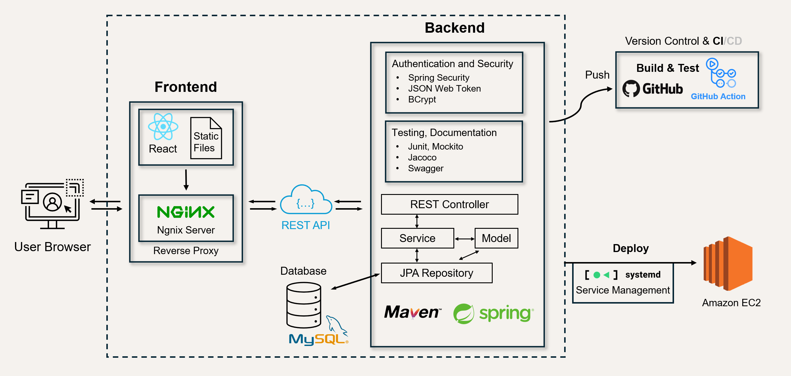

# Structure of this application


### EC2 service related documentation
To start the frontend service: ```sudo systemctl start nginx```

Rebuild the frontend: 
``` 
npm run build
sudo cp -r /home/ec2-user/TaskManager/tm_frontend/build/* /var/www/react-app
sudo systemctl restart nginx
```


To start the backend service: ```sudo systemctl start backend.service```
